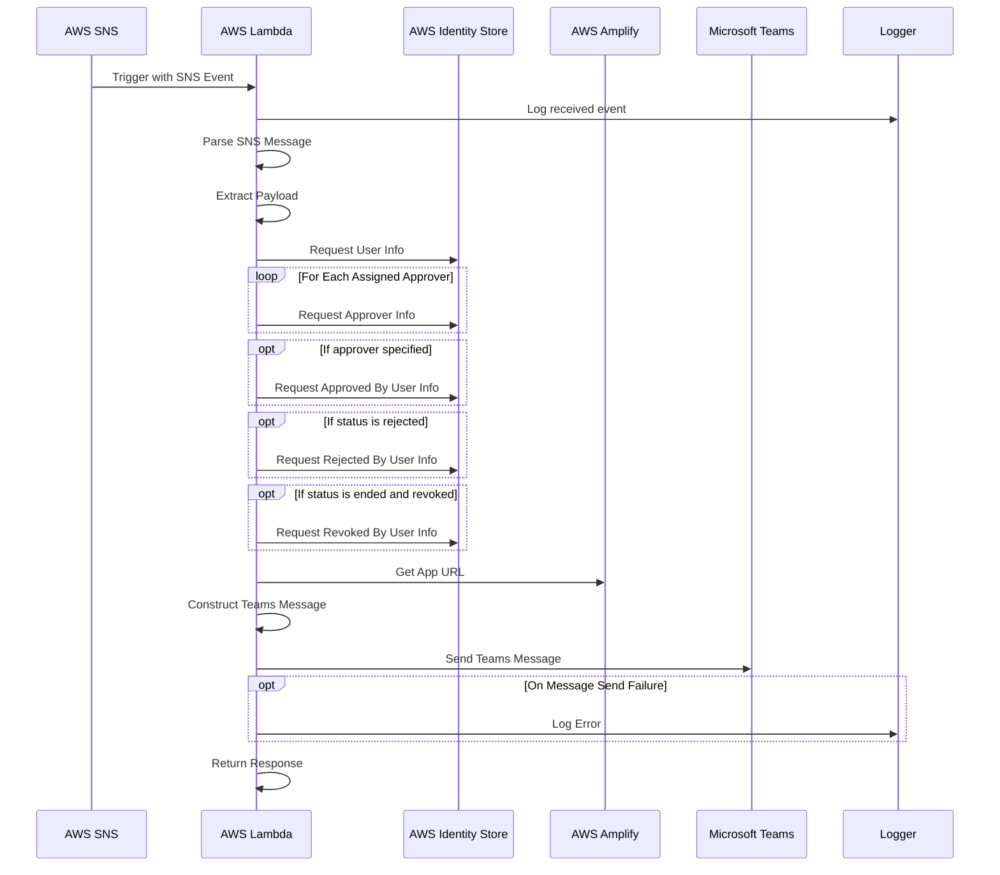
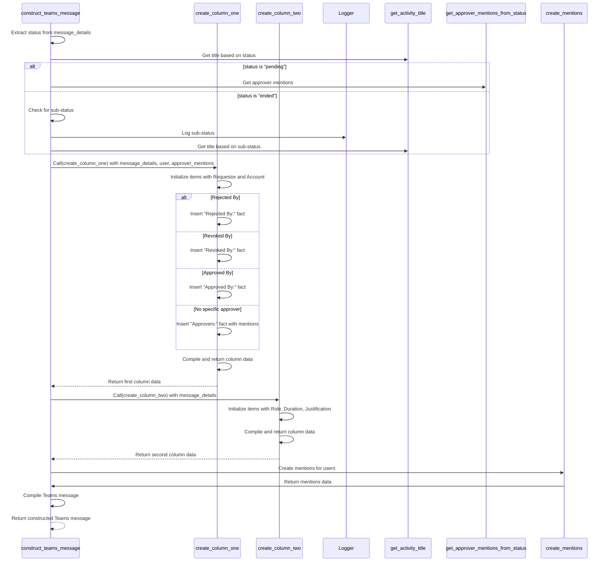

# Sequence Diagrams for ms-teams-notifications

## Lambda Handler

```mermaid
sequenceDiagram
    participant SNS as AWS SNS
    participant Lambda as AWS Lambda
    participant IdentityStore as AWS Identity Store
    participant Amplify as AWS Amplify
    participant Teams as Microsoft Teams
    participant Logger as Logger

    SNS->>Lambda: Trigger with SNS Event
    Lambda->>Logger: Log received event
    Lambda->>Lambda: Parse SNS Message
    Lambda->>Lambda: Extract Payload
    Lambda->>IdentityStore: Request User Info
    loop For Each Assigned Approver
        Lambda->>IdentityStore: Request Approver Info
    end
    opt If approver specified
        Lambda->>IdentityStore: Request Approved By User Info
    end
    opt If status is rejected
        Lambda->>IdentityStore: Request Rejected By User Info
    end
    opt If status is ended and revoked
        Lambda->>IdentityStore: Request Revoked By User Info
    end
    Lambda->>Amplify: Get App URL
    Lambda->>Lambda: Construct Teams Message
    Lambda->>Teams: Send Teams Message
    opt On Message Send Failure
        Lambda->>Logger: Log Error
    end
    Lambda->>Lambda: Return Response
```
 
 

## Message Constructor

```mermaid
sequenceDiagram
    participant CTM as construct_teams_message
    participant CC1 as create_column_one
    participant CC2 as create_column_two
    participant Logger as Logger
    participant GetAT as get_activity_title
    participant GetAM as get_approver_mentions_from_status
    participant CM as create_mentions

    CTM->>CTM: Extract status from message_details
    CTM->>GetAT: Get title based on status
    alt status is "pending"
        CTM->>GetAM: Get approver mentions
    else status is "ended"
        CTM->>CTM: Check for sub-status
        CTM->>Logger: Log sub-status
        CTM->>GetAT: Get title based on sub-status
    end
    CTM->>CC1: Call(create_column_one) with message_details, user, approver_mentions
    CC1->>CC1: Initialize items with Requestor and Account
    alt Rejected By
        CC1->>CC1: Insert "Rejected By:" fact
    else Revoked By
        CC1->>CC1: Insert "Revoked By:" fact
    else Approved By
        CC1->>CC1: Insert "Approved By:" fact
    else No specific approver
        CC1->>CC1: Insert "Approvers:" fact with mentions
    end
    CC1->>CC1: Compile and return column data
    CC1-->>CTM: Return first column data
    CTM->>CC2: Call(create_column_two) with message_details
    CC2->>CC2: Initialize items with Role, Duration, Justification
    CC2->>CC2: Compile and return column data
    CC2-->>CTM: Return second column data
    CTM->>CM: Create mentions for users
    CM->>CTM: Return mentions data
    CTM->>CTM: Compile Teams message
    CTM-->>CTM: Return constructed Teams message
```