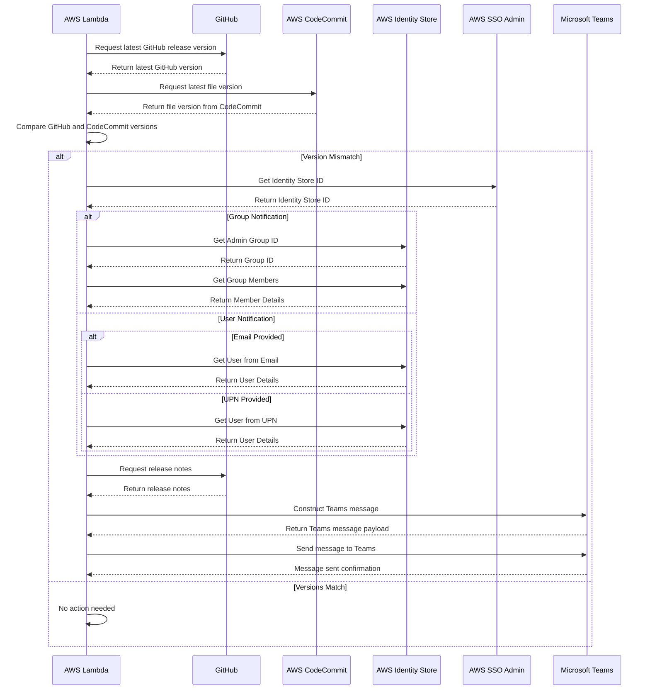

# Sequence Diagrams for temp-access-update-notifications

## Lambda Handler

```mermaid
sequenceDiagram
    participant Lambda as AWS Lambda
    participant GH as GitHub
    participant CC as AWS CodeCommit
    participant AIS as AWS Identity Store
    participant SSO as AWS SSO Admin
    participant MSTEAMS as Microsoft Teams

    Lambda->>GH: Request latest GitHub release version
    GH-->>Lambda: Return latest GitHub version
    Lambda->>CC: Request latest file version
    CC-->>Lambda: Return file version from CodeCommit
    Lambda->>Lambda: Compare GitHub and CodeCommit versions

    alt Version Mismatch
        Lambda->>SSO: Get Identity Store ID
        SSO-->>Lambda: Return Identity Store ID
        alt Group Notification
            Lambda->>AIS: Get Admin Group ID
            AIS-->>Lambda: Return Group ID
            Lambda->>AIS: Get Group Members
            AIS-->>Lambda: Return Member Details
        else User Notification
            alt Email Provided
                Lambda->>AIS: Get User from Email
                AIS-->>Lambda: Return User Details
            else UPN Provided
                Lambda->>AIS: Get User from UPN
                AIS-->>Lambda: Return User Details
            end
        end

        Lambda->>GH: Request release notes
        GH-->>Lambda: Return release notes
        Lambda->>MSTEAMS: Construct Teams message
        MSTEAMS-->>Lambda: Return Teams message payload
        Lambda->>MSTEAMS: Send message to Teams
        MSTEAMS-->>Lambda: Message sent confirmation
    else Versions Match
        Lambda->>Lambda: No action needed
    end
```